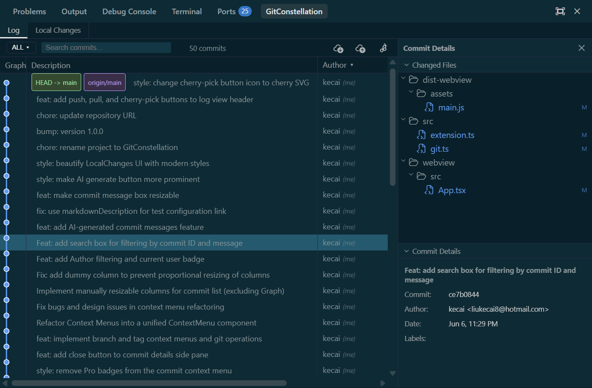
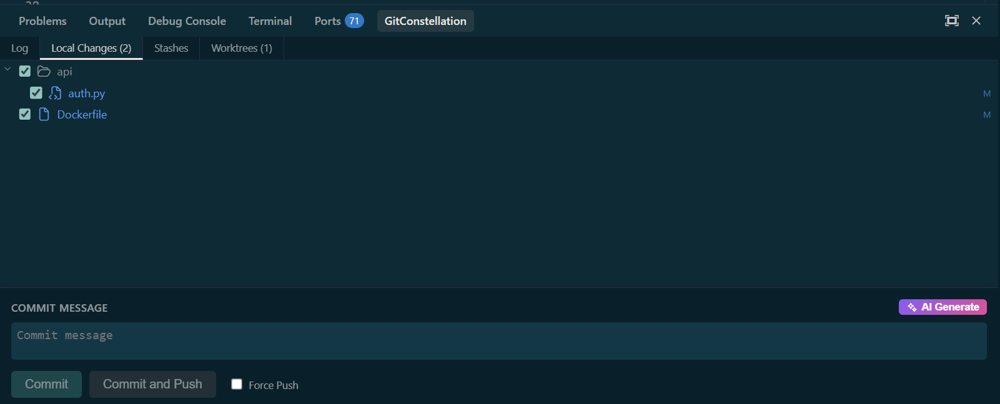
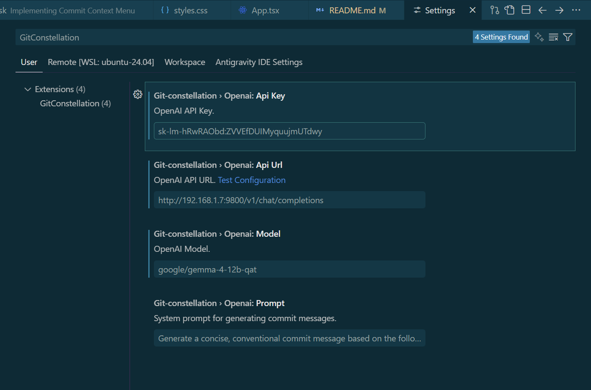

# GitConstellation - VS Code Extension

[English](#english) | [中文](#中文)

---

## English

GitConstellation is a VS Code extension that brings the highly acclaimed Git visualization and management experience from JetBrains IDEs to Visual Studio Code. It provides a powerful, multi-colored commit graph and a cohesive interface for managing local changes and history.

### ✨ Features

*   **JetBrains-Style Log View**: A multi-colored, interactive commit history graph with clear indicators for branches, tags, and remotes. Hovering over a commit displays a detailed metadata popup.
*   **Commit Side Pane**:
    *   **Tree View**: Modified files are shown in a hierarchical tree with status-based coloring (Added, Modified, Deleted, Renamed, Untracked).
    *   **Commit Details**: View full commit messages (preserving newlines and multiline formatting), author information, and associated refs.
*   **Integrated Diff Viewer**: Click on any file in the tree to open a side-by-side diff comparison in the main VS Code editor.
*   **Local Changes Manager**: A dedicated tab to stage changes, write commit messages, and discard changes.
*   **Stash Management**: A dedicated "Stashes" tab to view stashed changes, apply/pop/drop stashes.
*   **Worktree Management**: A dedicated "Worktrees" tab to list and manage git worktrees (open in a new window, remove, or prune).
*   **Submodule Management**: Integrated submodule branch sidebar to view and manage Git submodules effectively.
*   **File History View**: View a file's history via a simplified linear graph by right-clicking it in either the VS Code Explorer or the editor context menu. The active panel tab automatically switches to the "Log" tab.
*   **Multi-Select & Operations**: Select multiple commits with Ctrl+click or Shift+click to perform batch cherry-pick or squash contiguous commits on the current branch.
*   **Commit Editing**: Amend the HEAD commit message or rewrite older commit messages from the context menu.
*   **Branch & Tag Switcher**: Easily search and filter commits by tags, local/remote branches, and pin branches with interactive search fields.
*   **Performance & UI**: Loading animations for Git operations and a configurable max commit list limit.
*   **Native Look & Feel**: Uses VS Code's standard Codicons and theme-aware styling for a seamless experience.

### 🤖 AI-Powered Features

GitConstellation integrates with any OpenAI-compatible API (e.g. OpenAI, DeepSeek, Local LLMs, Gemini OpenAI interface) to streamline your Git workflow:

*   **AI Commit Message Generation**: Generates clean, conventional commit messages based on the diff of selected files in the Local Changes panel. Click the AI magic wand icon next to the commit input box to trigger.
*   **AI Stash Description**: Automatically generates a concise summary (under 60 characters) of your stashed changes, saving you from writing temporary descriptions.
*   **Highly Configurable**: Setup your custom API endpoint, API key, model name, and commit prompt templates directly in the VS Code Settings under `GitConstellation > OpenAI`.
*   **Settings Validator**: Run the `Test OpenAI Settings` command from the settings page or command palette to verify API connectivity.

### 📸 Screenshots

#### Log View & Commit History

#### Local Changes Panel

#### AI Commit Message Settings

### 🚀 Getting Started

1.  Clone this repository.
2.  Run `npm install` to install dependencies.
3.  Run `npm run compile` to build the extension and webview.
4.  Press `F5` in VS Code to start the extension in a new Extension Development Host window.
5.  Open the "GitConstellation" tab in the bottom panel (alongside Terminal/Output).

---

## 中文

GitConstellation 是一款 VS Code 插件，旨在将深受好评的 JetBrains IDE Git 可视化与管理体验带入 Visual Studio Code。它提供了一个强大的多色提交图谱（Commit Graph）以及一个用于管理本地更改和历史记录的统一界面。

### ✨ 功能特性

*   **JetBrains 风格日志视图**：交互式多色提交 history 图谱，清晰显示分支、标签（Tag）及远程分支标识。悬停在提交记录上可查看详细的悬停元数据卡片。
*   **提交详情侧边栏**：
    *   **树状视图**：以层级树结构显示修改的文件，并根据 Git 状态（新增、修改、删除、重命名、未追踪）进行着色。
    *   **提交详情**：查看完整的提交信息（保留换行与多行格式）、作者详情及关联的引用（Refs）。
*   **集成对比查看器**：点击文件树中的任何文件，即可在 VS Code 主编辑区直接打开双栏对比（Diff）窗口。
*   **本地更改管理**：专门的标签页用于查看/撤销本地更改、暂存修改，支持一键提交或提交并推送。
*   **Stash 暂存管理**：独立的 "Stashes" 标签页，用于查看所有 stash 列表、应用/弹出/丢弃 stash，以及支持清空所有 stash。
*   **Worktree 工作树管理**：独立的 "Worktrees" 标签页，列出当前工作树并支持一键在新窗口打开、删除或修剪 (prune) 工作树。
*   **Submodule 子模块管理**：集成的子模块分支侧边栏，支持高效查看和管理 Git 子模块。
*   **文件历史视图**：在 VS Code 资源管理器或编辑器右键菜单中选择“View File History (GitConstellation)”即可查看该文件的 Git 历史，并且插件面板会自动切换到“Log”标签页。
*   **多选与批量操作**：支持按 Ctrl/Shift 键多选提交记录，支持批量 Cherry-pick 及压缩（Squash）当前分支上的连续提交。
*   **编辑提交信息**：支持直接在右键菜单中修改（Amend）HEAD 提交信息，或者重写历史记录以修改旧提交的提交信息。
*   **分支与标签过滤**：增强的下拉筛选菜单，支持按本地/远程分支、标签（Tag）过滤提交列表，并支持置顶（Pin）常用分支，提供交互式的搜索输入框。
*   **性能与交互**：支持 Git 操作加载动画，以及可配置的最大提交列表数量限制。
*   **原生集成**：使用 VS Code 标准的 Codicons 图标库，并适配编辑器主题，确保完美的视觉集成。

### 🤖 AI 智能辅助功能

GitConstellation 集成了对任何 OpenAI 兼容 API（例如 OpenAI、DeepSeek、本地大模型、Gemini OpenAI 接口等）的支持，让你的 Git 工作流更加高效：

*   **AI 提交信息生成**：基于你在“本地更改”面板中选中的文件差异（Diff），一键生成符合规范（Conventional Commit）的提交信息。只需点击输入框旁边的 AI 魔法棒图标即可。
*   **AI Stash 暂存描述**：自动为你暂存的改动生成简明扼要的摘要描述（控制在 60 字符以内），告别手动填写临时说明。
*   **灵活的自定义配置**：可在 VS Code 设置项 `GitConstellation > OpenAI` 中直接配置自定义 API 地址（API URL）、API 密钥（API Key）、模型名称（Model）以及自定义 System Prompt 模板。
*   **一键配置测试**：可在设置页面或命令面板中运行 `Test OpenAI Settings` 命令来快速验证 API 连通性。

### 📸 界面截图

#### 日志视图与提交历史

#### 本地更改面板

#### AI 提交信息设置

### 🚀 快速开始

1.  克隆本仓库。
2.  运行 `npm install` 安装依赖。
3.  运行 `npm run compile` 编译插件和 Webview。
4.  在 VS Code 中按 `F5` 启动插件调试。
5.  在底部面板（终端/输出旁边）打开 "GitConstellation" 标签页。

---

## Acknowledgements | 致谢

*   **Icons**: File icons are powered by [Antigravity Icons Supercharged](https://github.com/DavidBabel/antigravity-icons-supercharged) (Blue version) by David Babel.
*   **图标**: 文件图标使用了由 David Babel 制作的 [Antigravity Icons Supercharged](https://github.com/DavidBabel/antigravity-icons-supercharged)（蓝色版本）。

---

## License | 开源协议

This project is licensed under the [MIT License](LICENSE).
本项目采用 [MIT 协议](LICENSE) 开源。
